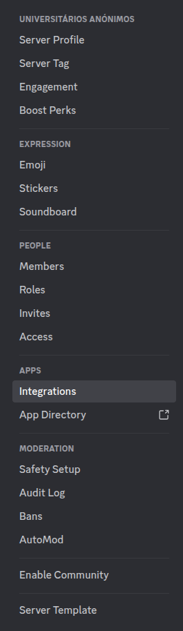
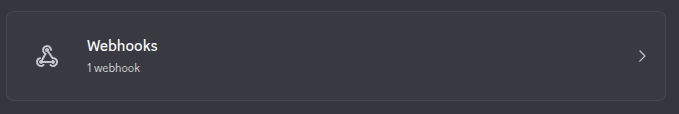

# canteen-ua-discord-bot

Posts the University of Aveiro canteen menu to Discord using a webhook.

This repository is set up to run automatically with GitHub Actions (`.github/workflows/daily-worker.yml`).

## GitHub Actions Setup (Recommended)

1. Fork this repository (or push it to your own repo).
2. Create a Discord webhook in the channel where you want the menu posted. (Go to your Discord server settings, then `Integrations` -> `Webhooks`.)



3. In your GitHub repo, go to `Settings` -> `Secrets and variables` -> `Actions`.
4. Create a repository secret named `DISCORD_WEBHOOK_URL`.
5. Paste your Discord webhook URL as the secret value.
6. (Optional) Create a repository secret named `EMENTAS_TAG` (example: `@ementas` or a role mention like `<@&ROLE_ID>`).
7. Go to the `Actions` tab and enable workflows if GitHub asks.
8. Run the workflow once using `Daily Cantinas Meal` -> `Run workflow`.

After that, GitHub Actions will run it on the configured schedule.

## Cron Timezone (GitHub Actions)

GitHub Actions cron uses UTC.

The current schedule `0 8 * * *` means:
- `08:00 UTC` every day (might have a delay of a few minutes)

## Workflow Environment Variables

Defined in `.github/workflows/daily-worker.yml`:

- `DISCORD_WEBHOOK_URL` (from GitHub secret, required)
- `CANTINAS_API_BASE` (default API URL)
- `TZ_NAME` (currently `Europe/Lisbon`)
- `WEBHOOK_USERNAME` (display name of the bot in Discord)
- `EMENTAS_TAG` (optional; if set, appends that tag/mention line to the message)

You can override these variables in the workflow file or set them as GitHub secrets for better security. 

## Local Run (Optional, for Testing)

No third-party packages are required (standard library only).

Requirements:
- Python 3.9+
- Internet access

Run locally:

```bash
DISCORD_WEBHOOK_URL="https://discord.com/api/webhooks/...." \
python3 canteen_api_fetcher.py
```

Or use a local `.env` file:

```env
DISCORD_WEBHOOK_URL=https://discord.com/api/webhooks/....
EMENTAS_TAG=@ementas
```

Test a specific date:

```bash
DISCORD_WEBHOOK_URL="https://discord.com/api/webhooks/...." \
TARGET_DATE="2026-02-24" \
python3 canteen_api_fetcher.py
```

If `EMENTAS_TAG` is not set, no extra tag line is added.

## What the Script Does

1. Fetches menu JSON from `https://api.cantinas.pt/`.
2. Filters entries to `Santiago` and `Crasto`.
3. Groups results by `Almoço` / `Jantar`.
4. Formats a Discord-friendly message.
5. Posts the message to your Discord webhook.
